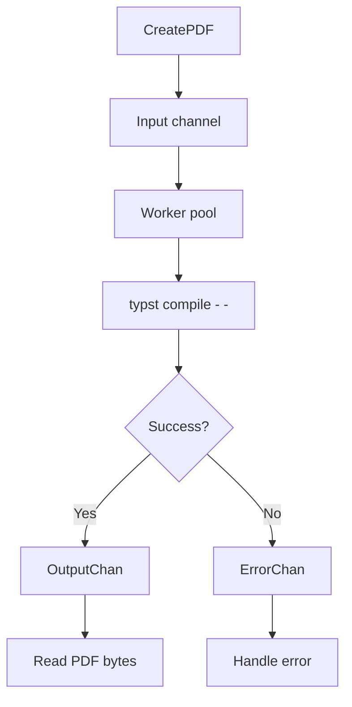

# Typst Concurrent Renderer

A small Go renderer that turns Typst source strings into PDF bytes.

It runs several `typst compile - -` commands at the same time, so one machine can render many PDFs faster than a single Typst CLI process.

## Why this exists

Typst is fast, but the CLI handles one compile at a time.

If your app needs to generate many PDFs, you usually want to keep all CPU cores busy. This project does that with a fixed worker pool. Each worker receives Typst source, runs the Typst CLI, and sends back either PDF bytes or an error.

## What it does

- Accepts Typst source as a string.
- Runs a fixed number of workers.
- Calls `typst compile - -` for each render.
- Uses a timeout so a stuck render does not block a worker forever.
- Sends successful PDF bytes to `OutputChan`.
- Sends render errors to `ErrorChan`.

## Flow



## Requirements

- Go
- Typst CLI installed and available in `PATH`

Check Typst:

```bash
typst --version
```

## Run Locally

Install or tidy Go dependencies:

```bash
go mod tidy
```

Run the sample stress test:

```bash
go run .
```

The sample renders `renderer/file.typ` 1000 times.

Run benchmarks:

```bash
go test -bench=. -benchmem -benchtime=10s ./renderer
```

## Basic Use

```go
r := renderer.New(renderer.RendererNew{
    InputChanSize:  24,
    OutputChanSize: 24,
    Workers:        12,
    ProcessTimeout: 5 * time.Second,
})

r.CreatePDF("# Hello from Typst")
r.WaitAndClose()

for pdf := range r.OutputChan {
    // use pdf bytes
}

for err := range r.ErrorChan {
    // handle render error
}
```

In a real app, read `OutputChan` and `ErrorChan` while sending work. This keeps the channels from filling up during large runs.

## Worker and Buffer Settings

The sample uses:

```go
workers := runtime.NumCPU()
bufferSize := workers * 2
```

This is a good starting point:

- `workers`: number of CPU threads
- `bufferSize`: `2x` workers

More workers can help until your CPU is full. After that, extra workers usually add overhead. A much larger buffer usually just stores more queued work without making Typst compile faster.

## Benchmark Result

Measured on Linux amd64 with an AMD Ryzen 5 5600H, 12 CPU threads.

Date: 2026-04-21

Stress run:

```text
Starting stress test: 1000 runs | 12 workers | 24 buffer
=====================================
Total Time taken : 11.077930344s
Avg Time taken   : 11.00 ms
Success Rate     : 1000/1000
Error Rate       : 0/1000
Throughput       : 90.27 PDFs/sec
=====================================
```

## Not Included

This package only renders PDFs. It does not include:

- HTTP or gRPC server code
- S3 uploads
- database tracking
- file naming or document history
