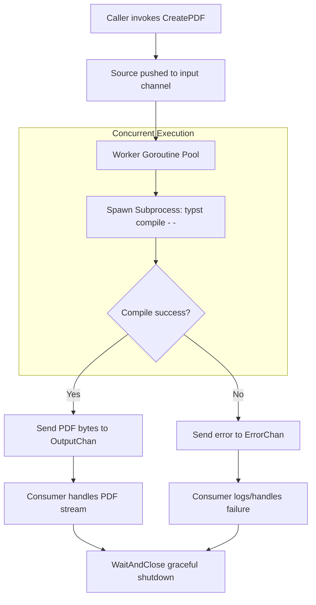

# Typst Throughput Renderer

A high-throughput, concurrent Go rendering pipeline designed to compile Typst source code into PDF bytes at maximum CPU saturation.

The focus of this project is raw speed: taking advantage of Typst's natively fast, Rust-backed compiler and scaling it horizontally across multi-core systems using Go's concurrency primitives.

## Motivation & Problem Solved

Typst was specifically chosen for its exceptional compilation speed (capable of generating massive documents in fractions of a second). However, as a CLI tool, it operates sequentially.

This project solves the concurrency bottleneck for high-volume document generation. By wrapping the Typst binary in a bounded Go worker pool with buffered channels, this pipeline allows a single machine to orchestrate hundreds of isolated compilation processes simultaneously, achieving predictable, stress-tested throughput without overwhelming the host OS.

## What this project does

- Ingests raw Typst source code as strings via an input channel.
- Spawns and manages a bounded goroutine worker pool optimized to `runtime.NumCPU()`.
- Orchestrates concurrent, isolated `os/exec` subprocesses (`typst compile - -`) through `exec.CommandContext`.
- Applies per-render process deadlines so stuck Typst compilations are killed instead of hanging workers forever.
- Streams binary PDF outputs and isolated error states through dedicated channels.

## Architecture & Data Flow



## Setup & Run Locally

### Requirements

- Typst CLI installed and available in your system `PATH`.

Verify installation:

```bash
typst --version

```

### Execution

1. **Clone the repository and tidy dependencies:**

```bash
go mod tidy

```

1. **Run the local stress test (1000 PDF generations):**
   This simulates a heavy workload using a sample `.typ` file.

```bash
go run .

```

1. **Run the CPU-bound benchmarks:**

```bash
go test -bench=. -benchmem -benchtime=10s -cpu=12 ./renderer

```

The benchmark runs multiple worker and buffer combinations so you can find the best values for your own hardware.

## Performance & Benchmark Results

Measured on: Linux (amd64), AMD Ryzen 5 5600H with 12 CPU threads
Date: 2026-04-21

### 1000-Document Stress Run

This run used `12 workers` and a `24` item buffer (`2x` the worker count).

```text
Starting stress test: 1000 runs | 12 workers | 24 buffer
=====================================
Total Time taken : 11.077930344s
Avg Time taken   : 11.00 ms
Success Rate     : 1000/1000
Error Rate       : 0/1000
Throughput       : 90.27 PDFs/sec
=====================================

```

### Choosing Worker and Buffer Values

The default stress-test configuration is:

```go
workers := runtime.NumCPU()
bufferSize := workers * 2
```

As a practical starting point, set workers equal to the number of CPU threads and keep the buffer at `2x` workers. That keeps every CPU thread busy while avoiding unnecessary queue growth.

To find the best setting for another machine, run:

```bash
go test -bench=. -benchmem -benchtime=10s ./renderer
```

More workers than available CPU threads usually adds context-switching overhead, and buffers much larger than `2x` generally queue more work without improving Typst compilation throughput.

## Out of Scope & Future Considerations

This project focuses entirely on maximizing compilation throughput. The following features were intentionally excluded to maintain performance clarity:

- **Document Lifecycle Management:** No S3 uploads, file identity, or database tracking.
- **Network Transport:** This is an internal engine, not an HTTP/gRPC server.
